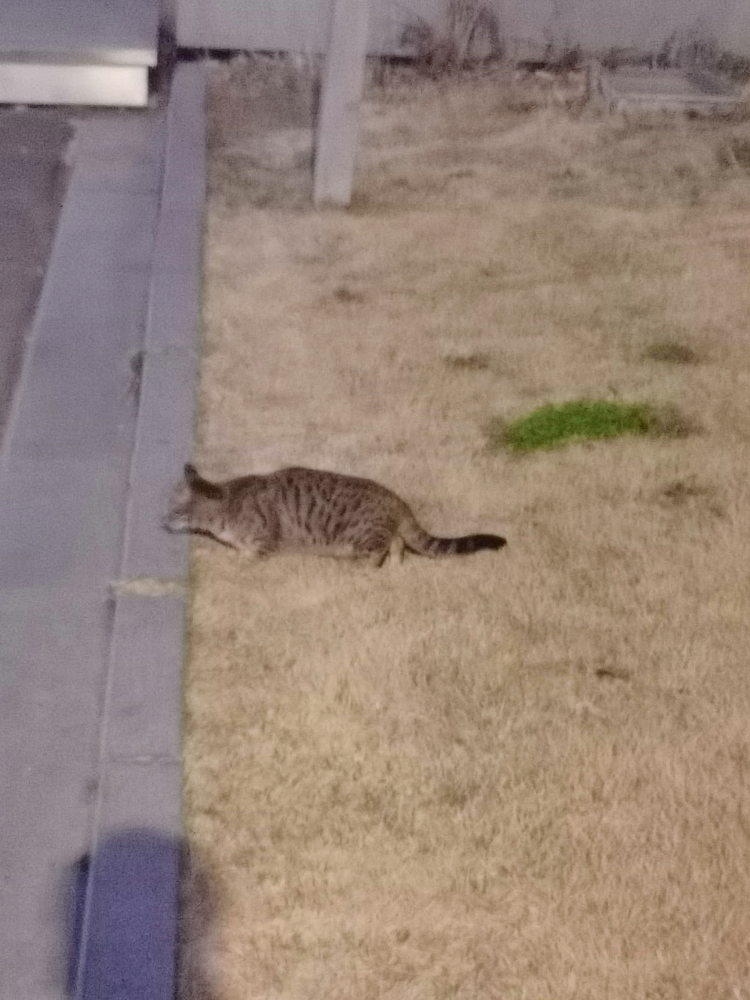
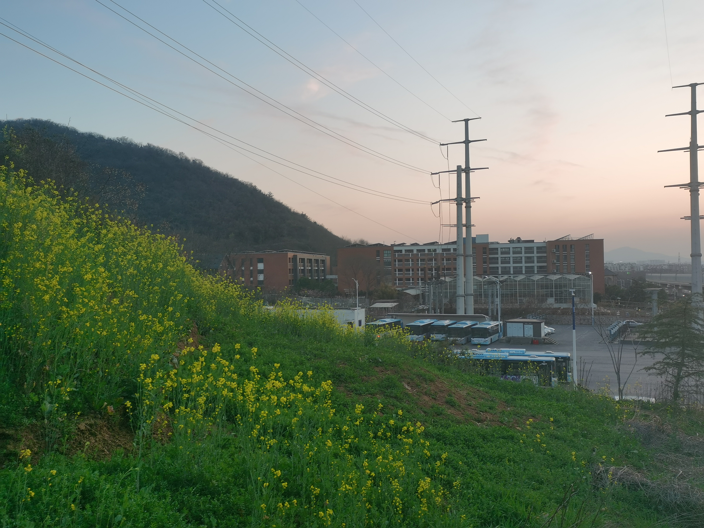
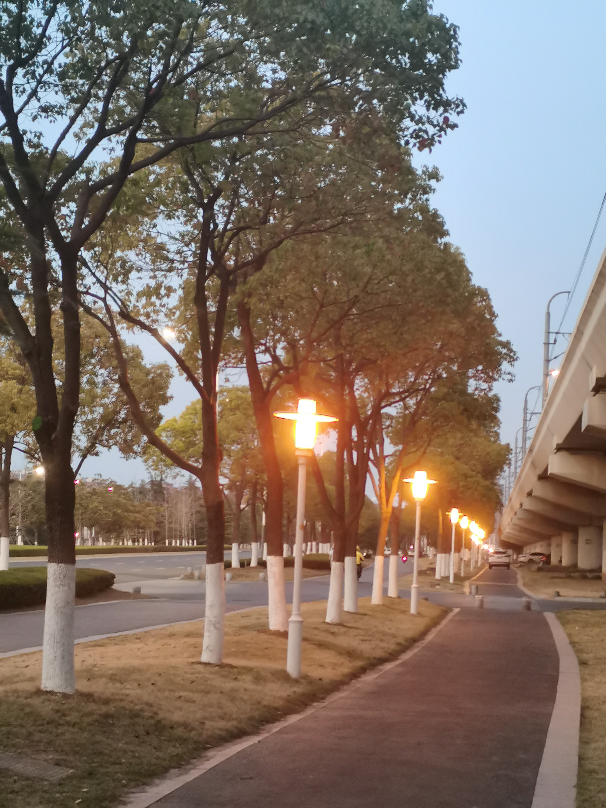
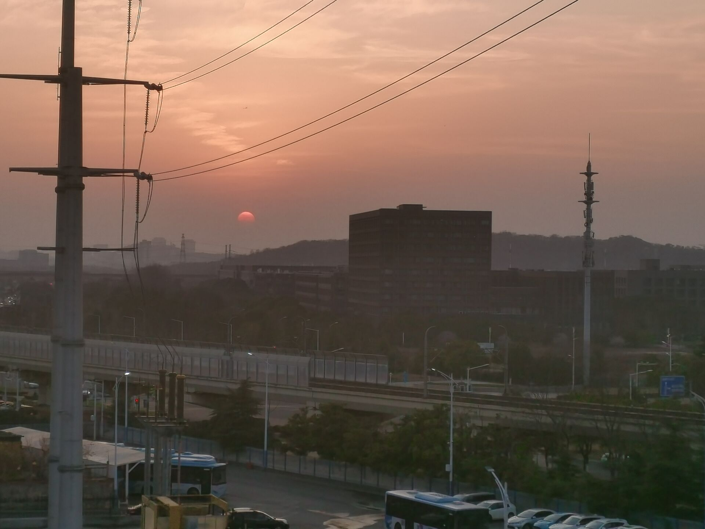

# 跑到和园东边的山上转悠

又一只看见我就跑的猫。图片的比例我真的没有弄错，但这玩意儿怎么看都更像黄鼠狼。

似乎是油菜花的东西开得不错。上次见到菜花大概是高中的时候清明节回家祭祖，高二之后似乎很少在清明节回去了。去年腊月过去的时候田里长着叫不上名字的低矮作物。不管是不是油菜，清明节不回去的我肯定是看不到的。

汽车站和一个记不得名字的小学，中途还有三个骑着自行车的小学生分别用手机和电话手表联系家长，手机揣在自行车的挂包上也不怕丢了。

爬山爬到一半被劝退，就又往东走了几步，没多久路灯就亮起来了。前面似乎是绵延几公里的灯带（近视眼看不到头）。路上没有人，索性用手机直接外放中岛美嘉的《僕が死のうと思ったのは》，拐角偶尔窜出几个电瓶车开得飞快的外卖小哥，想来也听不出我的社死行为。

下午五点多种的时候出去的，走了没多久天就渐渐暗下来。本来以为在山上能清楚地看到日落，没想到西边天上这么多云。其实下面的车流似乎更不错，不过我没弄明白怎么对焦到高架下面的路上。

[Prev](./insert-video.md)

[Next](./fairwell.md)

[Home](./index.md)