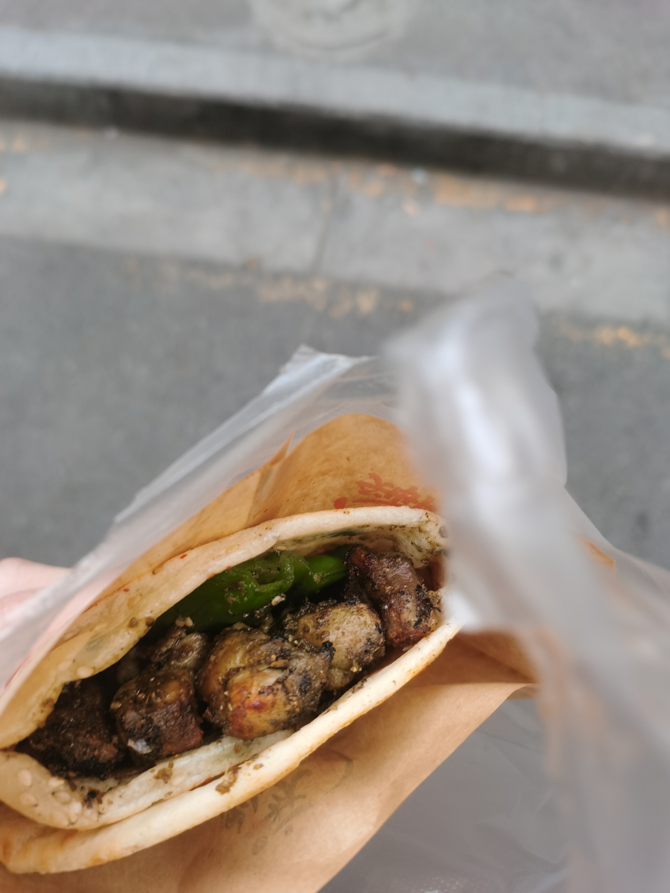
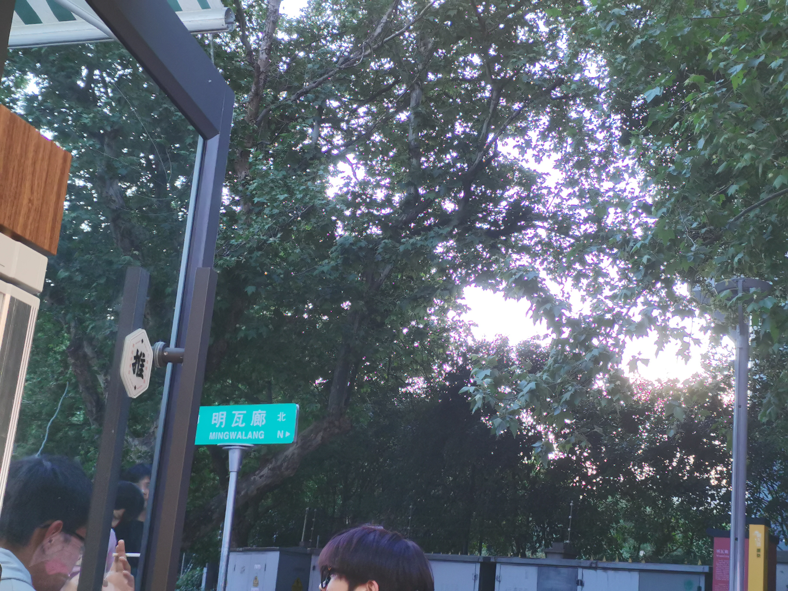
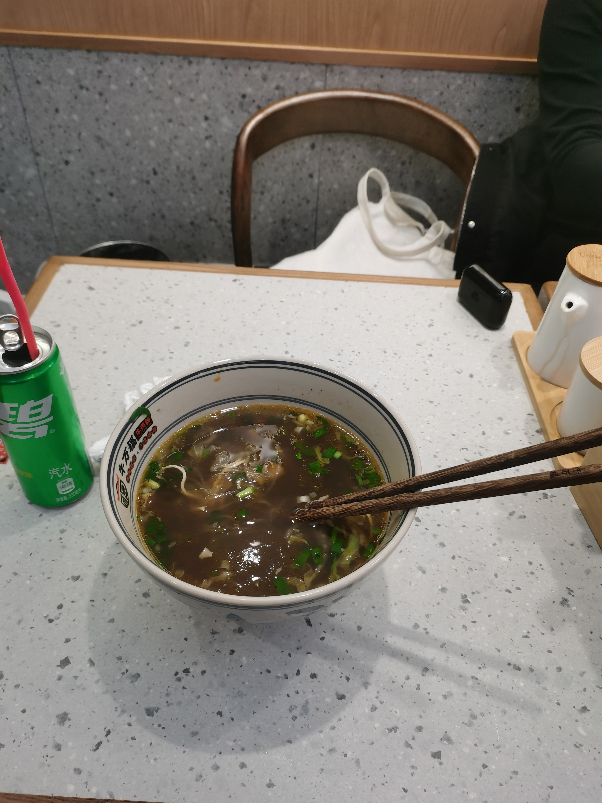
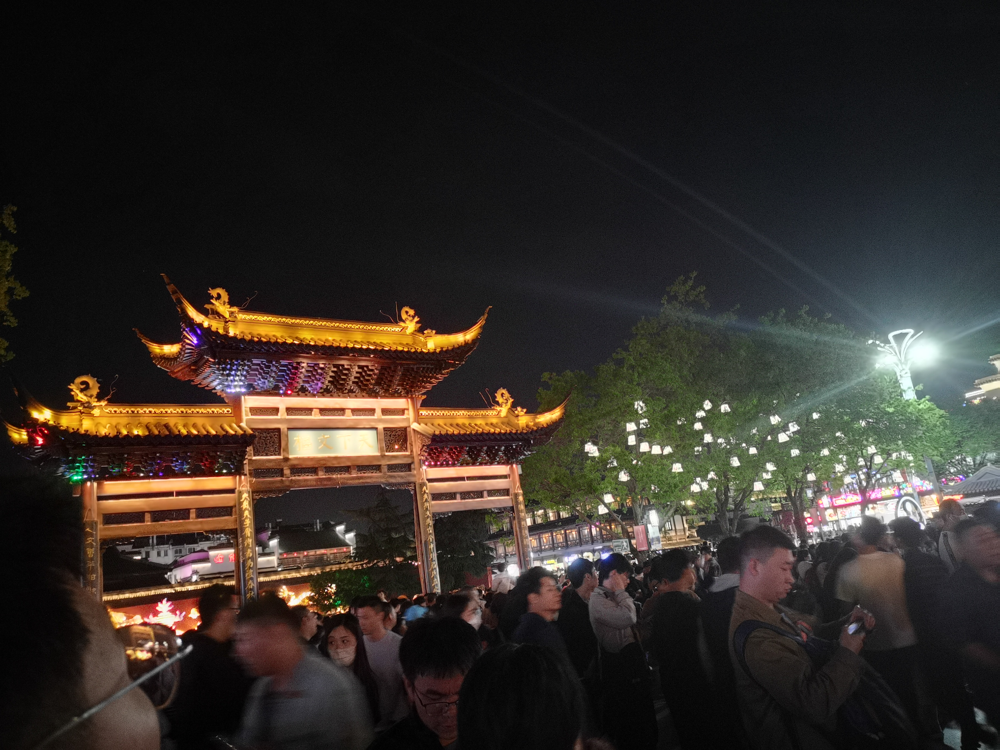
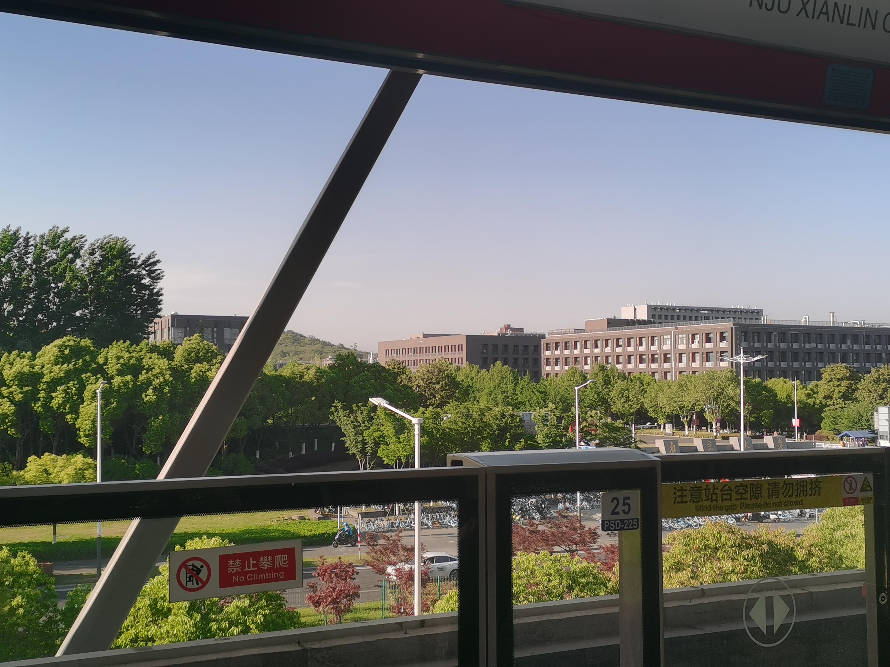
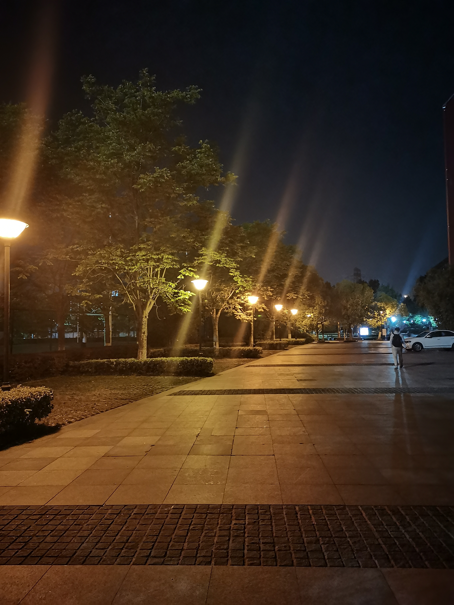

## 明瓦廊 & 夫子庙

舍友说要去明瓦廊美食街，我就跟着去了。晚饭吃到一半的时候想起来夫子庙这回事，叫上舍友同去。

### **明瓦廊**

<table><tr>
<td>

</td>

<td width="200">
在明瓦廊买的小吃，所谓“百年传承”简单来说是桶炉烧饼包着烧烤。烤肉孜然放的很足，到手的时候饼皮还是滚烫的，馅料里加的青椒算是不错的创新。
</td>
</tr></table>

<table><tr>
<td>

</td>
<td>

</td>
</tr></table>

晚饭是在明瓦廊尽头处的一家牛肉粉店吃的。店面不大，不过看起来非常清爽。我们一人来了一份牛肉粉。端上来的时候是挺大的一碗，内容物充分符合“大汤小面”的原则，也确实管饱。

### **夫子庙**

去夫子庙是个错误的决定。

饭后走了半个小时到达，夫子庙入口人满为患，进去之后是无聊的商业街，路上碰到一个叫做“思贤庄”的地方，门口就能听到风铃的响声，进去之后看到天花板上挂满了写着愿望的木牌，路的两侧是喷着雾气的雕像，颇有曲径通幽的意味。再往里走就是个纪念品商店，遂感叹“天下乌鸦一般黑”，奋然回头。

商业街尽头右转，才算正式到了夫子庙入口。大门左侧的墙上是“学而不思则罔，思而不学则殆”，右手边赫然是“学思想、强党性、重实践、建新功“的名言。想来倘若孔圣人再世，至少是个入党积极分子。

<table><tr>
<td>
	
</td>
<td width="200">
夫子庙对面的牌坊，旁边是划船收费的地方，秦淮河应该就在附近吧。没有多看，径直向西，出了夫子庙景区。
</td>
</tr></table>

### **好天气 & 夜游神**

<table><tr>
<td>
	
</td>
<td>
	
</td>
</tr></table>

等到挤地铁回来，已经是晚上9点多钟。放假第一天，不少同学已经回家，路上行人不多。

[Prev](./out1.md)

[Home](../index.md)