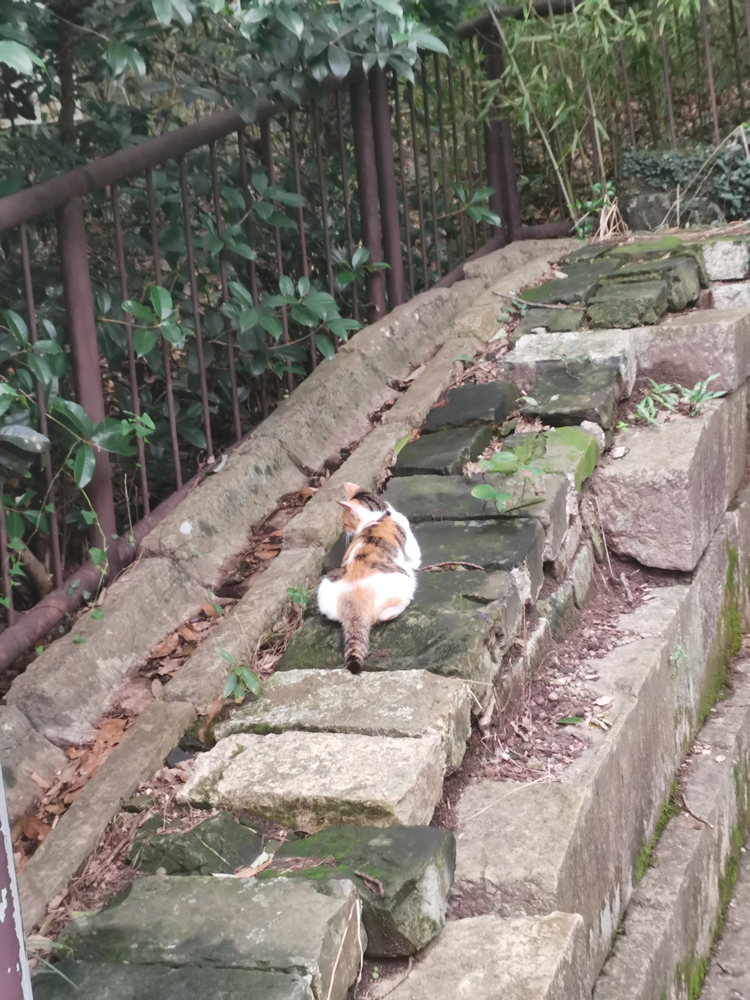

## 玄武湖 & 钟山风景区

### 写在动身之前

愛してるっていう

あなたの言葉は

さよならよりも哀しい

上网搜了一下，看到中山陵、明孝陵、玄武湖公园在地图上糊成一片，顿时后悔自己不够勤快：大概出去一趟就能把几个景点看个遍，好比一顿自助餐顶两顿饿，岂不妙哉。

原来唐人李贺早就有“衰兰送客咸阳道，天若有情天亦老”的佳句，那么“人间正道是沧桑”算是二次创作吧。明天出发的时候大概率不会有“钟山风雨起苍黄”的盛景，假如真的有雨，也不知道该不该感到庆幸，毕竟这两天南京挺热。

不知道当年隔江相望的毛泽东同志到底能不能看到钟山上的风雨，倘若能的话，南京又为什么不搞搞“渡江作战前敌指挥部遗址”呢；倘若不能，我依稀记得十七八岁的时候对此类情况准备了一整套赏析的模板，未必不能充作一条不完备的解释。

钟山风景区看上去占地面积不小，相比之下五一节期间逛了一晚上的夫子庙也显得小了。不过看两眼就结束，应该不会停留多长时间。相比之下，我更好奇明孝陵和中山陵里面能有什么。从一个游客的角度来看，如果恁大的一块地单单放着打包好的先人，那不妨直接弄成直系血亲的祭拜场所算了；但真要说里面花红柳绿、风景宜人，岂不是“长活人志气，灭鬼神威风”，没有意思了。

舍友曾经去玄武湖划船。不过这个时间荷花应该还没有开，芙蓉桥也只是一座光秃秃的桥吧。大老远跑过去晒晒南京七月头的太阳，多不是一件美事啊。

我在高中时期反复在作文中论述着一座山不仅是山、一湖水不光是水。时过境迁，自己却开始读不透这一座山、一湖水，到底是当时年少轻狂，还是如今才思驽钝？这种割裂的感觉一直伴随着我。

これ以上何も言わなくていい

だからこの夜を止めてよ

### 钟山风景区

定了一个早上8点的闹钟，不过我9点起床。

出来之后有快一半的时间在赶路，顶着大太阳在人堆里往前踱。

#### 中山陵

在下马坊下车，步行2.4公里（数据由缺德地图提供）到达中山陵。不得不吐槽哪里都能弄出个商业街来，中山陵附近也不例外。山上的东西卖得奇贵无比，路边的老冰棍口径统一，2元一根。虽然是工作日，景区的人还是很多，真是活见鬼，暑假不应该是高贵的学生阶级和少数人的特权吗？（狗头保命

原来中山陵不要门票，也怪我事先没有仔细准备，还把身份证也带过来了。陵园其实不大，灵堂前长长的台阶作为主要的组成部分，视觉效果上十分地劝退，两侧奇松怪柏，都是我先前没有见过的。台阶上有人顶着太阳吆喝，宣传景区免费拍照服务。

<table><tr>
<td>

</td>

<td>

</td>
</tr></table>

<table><tr>
<td>

</td>
<td width="200">
到了灵堂前再看台阶，当时想的是回头要走到什么时候
</td>
</tr></table>

走过不知道多少级台阶，俯瞰雾气笼罩的南京城。

<table><tr>
<td>

</td>

<td>

</td>
</tr></table>

灵堂内多少有了一点庄重肃穆的氛围，不过不让拍照。孙先生和他的同仁奋斗毕生的成果刻写在灵堂一侧的墙壁上。繁体中文 + 字迹剥落，大致是在叙述最初中华民国的政体。

中午就在附近的麦当劳蹭空调，外面30多度，里边凉风习习，斯巴拉西～。

麦当劳里遇到从山东来的一家子，小伙子挺有意思。

总体上来说还是人太多了。大胆假设中山陵里头一个人也没有，又会是怎样诡异的画面？

#### 明孝陵

~~封建余孽岂敢收我门票！~~

<table><tr>
<td>

</td>

<td width="200">
从五号门进，首先看到的是四方城。屋顶富丽堂皇，大概是后世修复甚至重做过。城墙显得饱经风霜，不知道是不是按书上所说拿红糖拌糯米砌墙。
</td>
</tr></table>

<table><tr>
<td>

</td>

<td width="200">
下午晴转多云，经过神道石刻的时候正好放晴了
</td>
</tr></table>

神道石刻实在是没有看头。若干石雕历经数百年的风吹雨打，大部分只剩一个大概的形状让人来判断一下这究竟是什么动物。文臣武将的雕像大概是三头身，透着一种大大方方的笨拙。

明孝陵的主体建筑，包括正门、碑殿、享殿、方城、明楼等。

<table><tr>
<td>

</td>
<td width="200">
享殿周围的古建筑，有点old-fashion。享殿应该是重建的，在卖纪念品，真是防不胜防。隔着窗户看去，几个灯泡分外扎眼，不知道的还以为明朝人也要搞现代化了。
</td>
</tr></table>

穿过享殿就是明楼。远远看去，十多米高的城墙很是壮观，毕竟现代建筑领域少见这样空间利用率低的设计方案。从城门口进去，穿过一条黑黢黢的甬道上了二楼，再走台阶到了明楼的最高层。城楼里是”明地宫VR体验馆“，周围还有相关的图片，朱元璋先生长脸和圆脸的画像都有，假如他本人泉下有知，不知道会中意哪一张。

<table><tr>
<td>

</td>
<td>

</td>
</tr></table>

<table><tr>
<td>

</td>

<td width="200">
明楼上的一只猫，趴在城墙上稳如泰山，行人如织，就是不肯回头看上一眼。
</td>
</tr></table>

~~单看这只猫，门票也值了~~。

### 玄武湖

*走不动了，不去了*

~~想不到吧，虚晃一枪~~

<a herf="https://y.qq.com/n/ryqq/songDetail/880413">この夜を止めてよ</a>

[Prev](./out3.md)

[Home](../index.md)
