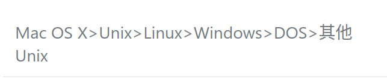

# Wayback

<iframe src="//player.bilibili.com/player.html?aid=529412453&page=1&danmaku=0" allowfullscreen="allowfullscreen" width="100%" height="500" scrolling="no" frameborder="0" sandbox="allow-top-navigation allow-same-origin allow-forms allow-scripts"></iframe>

《宇宙战舰大和号》我是没有看过的

~~把b站的链接到处乱贴算什么本事~~，*只要把能吐槽的点都吐槽完，就不会再被吐槽了*

~~网易云上原唱要会员，不让贴链接，所以我们用b站的~~

b站有这样一条弹幕：贫穷使我们相会，多见于网易云、QQ音乐会员歌曲的mv中

    I've gone too far, there is no way back.

    wayback machine

wayback 和 way back 翻译起来是不一样的

这几天晚饭之后会到操场上走两步，希望没有体育课之后状态不会太差。不过我并不对此抱太大希望

连续两天晚饭都是9食堂的烤盘饭，每次都忘记带上手机拍它几张照片

网页内容再怎么丰富也不能弥补qq空间和微信朋友圈的空虚 ~~你行你来发啊~~

隔壁宿舍的簸箕让装修宿舍的好人顺走了，找我们借东西打扫宿舍

手机上下了个读库app，希望能多读读书

~~无话可说就别用流水账折磨github的服务器了~~

微信开发者工具竟然不提供linux版本，QQ都有linux版了，微信团队给点反馈、考虑一下操作系统鄙视链

胡言乱语也不能带来多大的乐趣

gradio, flask

[Prev](./out4.md)

[Home](../index.md)